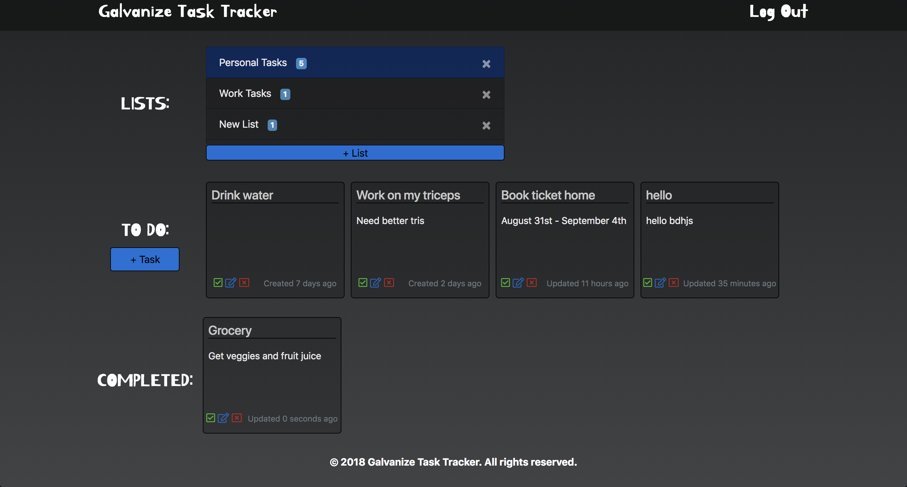

# Galvanize Task Tracker

This repository is the client to a backend created by our instructor, Wes.  This project demonstrates the implementation of authentication and authorization on the backend of a Node and Express application.

[Galvanize Task Tracker](https://surya_nate_task_tracker.surge.sh)

## About  

This is an application to keep track of various tasks. Galvanize Task tracker can be used for both personal and professional requirements.

## Features

  -New user can signup with first name, last name, unique email and password.
  -Existing users can login with email and password.
  -The User can add and delete lists
  -The User can add tasks to selected lists.
  -Tasks can be updated or deleted.
  -User can toggle the tasks between completed tasks and incomplete tasks.

## What Galvanize Task Tracker looks like?

Login page:

Home Page:

## How to install?

-Fork and clone the repo.
-Run npm install in the repo.
-Run npm run dev start.

### Technologies used

    -HTML5, CSS3, JS
    -Bootstrap
    -Browserify, Watchify, Live-server
    -Axios
    -knex

#### Developed by Nate Semmler and Surya Krishna Moorthy
